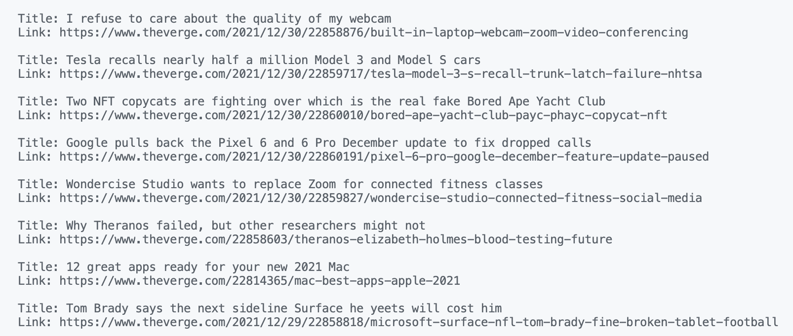

# READ ME
**Verge Scraper** is a lightweight web scraper for parsing featured article titles and links of the tech publication, The Verge. Additionally, this can be manipulated to scrape different websites and/or data.

Built with:
```
- Python
- Beautiful Soup
```

To run:
```
- Install Requests and Beautiful Soup for Python 
- Open app.py
- Run (results are printed in log)
```

Preview:

